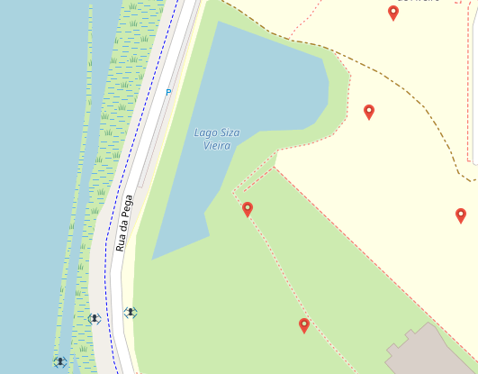

# Drones-Scanning
This project was developed within the scope of the curricular unit Networks and Autonomous Systems.

## Resume
The objective of this project is to use drones to analyze agricultural fields, using the V2C communication type in the context of VANET networks (Vehicular Ad Hoc Networks).
To analyze an image, a python program was created which is based on looking for green, yellow and brown pixels (the most abundant colors in an agricultural field) and calculating their percentage. According to this percentage it is determined whether or not the field needs to be watered.

## Getting Started

Follow the steps below to set up and run the project:

1. Push the docker image from [https://code.nap.av.it.pt/mobility-networks/vanetza](https://code.nap.av.it.pt/mobility-networks/vanetza).

2. Open three terminals.

3. In the first terminal, run the following command: sudo docker-compose up -d

4. In the second terminal, run the following command: python3 app.py

5. In the third terminal, run the following command: python3 obu_simulation.py

## Project Map Example when run the project

The red markers correspond to the zones that will be analyzed by the drones.

